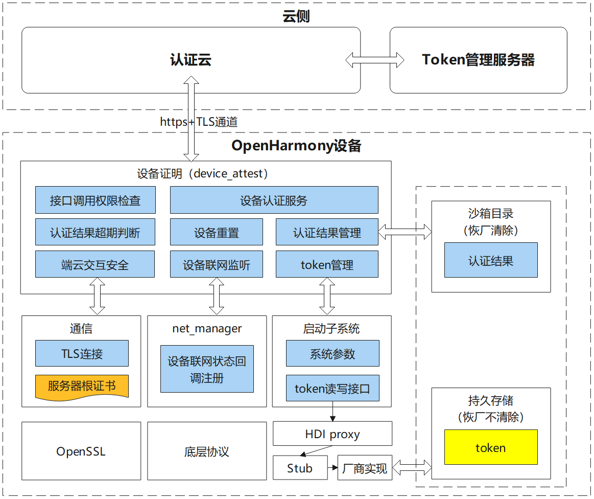

# xts_device_attest组件<a name="ZH-CN_TOPIC_001"></a>

-   [简介](#section100)
-   [目录](#section200)
-   [架构图](#section300)
-   [约束](#section400)
-   [集成指导](#section500)
    -   [名词解释](#section501)
    -   [伙伴完成信息登记](#section502)
    -   [设备证明模块依赖接口适配](#section503)
    -   [对外接口](#section504)
    -   [编译指令](#section505)    
-   [相关仓](#section600)


## 简介<a id="section100"></a>

xts_device_attest组件：

-   device_attest，即设备证明组件，其基本功能是看护OpenHarmony生态设备认证结果，通过端侧数据上云，达成统计OH生态设备数量的目标。目的是统计OH设备数量。该组件用于标准系统（standard system）。

## 目录<a id="section200"></a>

```
/test/xts
├── device_attest               # 设备证明模块代码存放目录
│   └── build                   # 编译配置存放目录
│   └── common                  # 公共基础能力
│   └── figures                
│   └── interfaces              # 对外接口
│   └── sample                  # 对外接口示例
│   └── services                # 服务主体和业务逻辑代码
│       └── core                # 业务逻辑代码
│       └── devattest_ability   # 服务框架
│       └── etc                 # 启动配置文件存放目录
│       └── sa_profile          # 进程配置文件存放目录
│   └── test                    # 测试用例编译配置存放目录
│       └── data                # 测试用例打桩数据存放目录
│       └── unittest            # 测试用例代码存放目录
```

## 架构图<a id="section300"></a>



## 约束<a id="section400"></a>

轻量级设备证明的集成依赖库如下表：

| 库名称    | 版本号           | 功能描述                                        | 备注                                     |
| --------- | ---------------- | ----------------------------------------------- | ---------------------------------------- |
| mbedtls   | 2.16.11          | 供嵌入式设备使用的一个 TLS 协议的轻量级实现库。 | 仓库路径..\third_party\mbedtls           |
| OpenSSL   | 1.1.1          | 传输层安全（TLS）协议（包括SSLv3）以及通用密码库。 | 仓库路径..\third_party\openssl           |
| cJSON     | 1.7.15           | JSON 文件解析库。                               | 仓库路径..\third_party\cJSON\third_party |
| libsec    | 1.1.10           | 安全函数库。                                    | 仓库路径..\bounds_checking_function      |
| parameter | OpenHarmony 1.0+ | 获取设备信息的系统接口。                        | 仓库路径 ..\base\startup\init\interfaces\innerkits\include\syspara\parameter.h                    |


## 集成指导<a id="section500"></a>

### 名词解释<a id="section501"></a>

**表 1** 
| 名词       | 解释                                                         |
| ---------- | ------------------------------------------------------------ |
| 伙伴       | 申请 OpenHarmony 兼容性测评的企业，下文统称为“伙伴”。需要集成设备证明模块。 |
| manuKey    | 伙伴从[OpenHarmony 兼容性平台](https://openatom.cn/atomavatar/#/login?redirect=%2Fauthorize%3Fresponse_type%3Dcode%26client_id%3D6bdacef0a8bd11ec938bd9550d2decfd%26redirect_uri%3Dhttps%3A%2F%2Fcompatibility.openharmony.cn%2Fconsole%26appName%3DOpenHarmony%E8%AE%A4%E8%AF%81%E5%B9%B3%E5%8F%B0%26scope%3D0,1,2,3%26state%3D%2Fpersonal)官网获取的秘钥。用于对产品中相关数据进行加密保护。为了保证多产品的兼容性，manuKey 在所有产品的生命周期内都应保持不变。 |
| productId  | 伙伴从 OpenHarmony 兼容性平台官网申请兼容性测评时，平台为测评产品分配的唯一产品标识。productId 在产品生命周期内需保证始终不变。 |
| productKey | 伙伴从 OpenHarmony 兼容性平台官网申请兼容性测评时，平台为测评产品分配的唯一产品秘钥。其与 productId 一一对应，用于对产品级的数据进行加密保护。同样需保证在产品生命周期内始终保持不变。 |
| 软证书     | 伙伴从 OpenHarmony 兼容性平台官网获取，由平台分配的设备凭据，每台设备一个，标识设备身份。需存储在安全分区，在恢复出厂设置、镜像升级时也不能被清除。 |

### 伙伴完成信息登记 <a id="section502"></a>

伙伴需要在[OpenHarmony 兼容性平台](https://openatom.cn/atomavatar/#/login?redirect=%2Fauthorize%3Fresponse_type%3Dcode%26client_id%3D6bdacef0a8bd11ec938bd9550d2decfd%26redirect_uri%3Dhttps%3A%2F%2Fcompatibility.openharmony.cn%2Fconsole%26appName%3DOpenHarmony%E8%AE%A4%E8%AF%81%E5%B9%B3%E5%8F%B0%26scope%3D0,1,2,3%26state%3D%2Fpersonal)网上注册关于产品设备的一系列基础信息，如：公司简称（英文）、品牌英文名称、设备型号等。
在设备证明处理流程中，设备证明模块读取设备信息并上报基金会云，基金会云进行校验验证。因此需要伙伴提前在 OpenHarmony 兼容性平台官网上完成产品的信息登记，分如下两个步骤：  
1）伙伴在 OpenHarmony 兼容性平台官网上完成设备信息登记。  
2）伙伴将 OpenHarmony 兼容性平台官网上登记的设备信息写入设备。  

1.  伙伴在 OpenHarmony 上完成信息登记

    伙伴需要在 OpenHarmony 兼容性平台上注册相关设备证明数据，请按照官网上的注册流程完成。

2.  伙伴将登记OS信息写入设备

    针对伙伴在 OpenHarmony 兼容性平台上登记的信息，版本包提供了相关接口供伙伴进行填写。
在调用身背证明函数时，会将伙伴填写的值上报给基金会云，基金会云会将上一节注册的信息与设备上报的信息进行对比校验。
设备证明模块依赖部分设备信息，需要伙伴适配修改。  
设备信息位于启动恢复子系统中的 base/startup/init/services/etc/param/ohos_const/ohos.para 文件下。设备OS信息如下表：

**表 2** 
| 设备信息         | ohos.para 配置参数                                           | 备注                         |
| --------------- | ------------------------------------------------------------ | ---------------------------- |
| 发布类型         | const.ohos.releasetype=Beta                                 | 使用默认值    |
| api版本          | const.ohos.apiversion=6                                     | 使用默认值    |
| 安全补丁标签     | const.ohos.version.security_patch=2021-09-01                | 2021-09-01需要替换成真实值   |
| 软件版本号       | const.ohos.fullname=OpenHarmony-1.0.1.0                      | 使用默认值 |
  
设备信息位于芯片的系统参数中的 base/startup/init/services/etc/param/ohos.para 文件下。设备产品信息如下表：

**表 3** 
| 设备信息         | vendor.para 配置参数                                | 备注                         | 
| ---------------- | ------------------------------------------------- | ---------------------------- |
| 企业简称（英文）  | const.product.manufacturer=****                  | **** 需要替换成设备真实值 |
| 品牌英文名        | const.product.brand=****                         | **** 需要替换成设备真实值 |
| 设备型号         | const.product.model=****                            | **** 需要替换成设备真实值    |
| 软件版本号       | \# const.product.software.version="OpenHarmony 1.0.1"    const.product.software.version=OpenHarmony 3.3.3.3 | "OpenHarmony 1.0.1"  需要替换成设备真实值 |
| 版本 id          |                                                     | 不需要伙伴操作，系统自动生成 |
| 版本 Hash        | const.ohos.buildroothash=default                    | 添加该数据 default需要替换成设备真实值|

注：版本 id 需要通过设备获得，填写在 OpenHarmony 兼容性平台，版本 id的组成如下：
VersionId = deviceType/manufacture/brand/productSeries/OSFullName/productModel/softwareModel/OHOS_SDK_API_VERSION/incrementalVersion/buildType

版本 id获取:   
    1) 完成OS信息和产品信息写入设备后  
    2) 放开加密日志(修改下图中PrintDevSysInfo修改的地方)  
    3) 烧录  
    4) 通过日志查看当前版本 id  

 

最后通过日志查看当前版本 id

 


### 设备证明模块依赖接口适配 <a id="section503"></a>

为了屏蔽不同模组底层实现差异，vendor中定义了软证书相关 API，由伙伴具体适配实现，接口定义如下表：

**表 4** 
| 功能                                            | 接口定义                                                   | 参数定义                                                     | 返回值                | 归属文件                  |
| ----------------------------------------------- | ---------------------------------------------------------- | ------------------------------------------------------------ | --------------------- | ------------------------- |
| 读取 manuKey                                    | int32_t HalGetManufactureKey(char\* manuKey, uint32_t len) | acKey：秘钥存储内存 len：内存长度                          | 0：成功      -1：失败 | ..\hal_token.h |
| 读取 ProductId                                  | int32_t HalGetProdId(char\* productId, uint32_t len)    | productId：产品型号标识len：存储空间长度                     | 0：成功    1：失败    | ..\hal_token.h |
| 读取软证书                                      | int32_t HalReadToken(char\* token, uint32_t len);          | token：存储软证书的空间len：存储软证书的长度                 | 0：成功     1：失败   | ..\hal_token.h |
| 写入软证书                                      | int32_t HalWriteToken(char\* token, uint32_t len);         | token：存储软证书的空间len：存储软证书的长度                 | 0：成功    1：失败    | ..\hal_token.h |
| 读取 ProductKey（预留接口，暂时不需要伙伴适配） | int32_t HalGetProdKey(char\* productKey, uint32_t len)  | productKey：型号产品（唯一）秘钥len：每个型号产品（唯一）秘钥 | 0：成功      1：失败  | ..\hal_token.h |


    1. HalGetManufactureKey  
    manuKey 是和软证书配套，生成 AES 秘钥的参数，具体从 OpenHarmony 兼容性平台下载。  


    通过工具把 ASCII 码转化成 16 进制。  
  


  


    预置在 HalGetManufactureKey 接口的返回值里。  


    2. HalGetProdId  
    ProductId 是和软证书配套，生成 AES 秘钥的参数，具体可以在 OpenHarmony 平台查看。  


    预置在 HalGetProductId 接口的返回值里。  


    3. HalReadToken 和 HalWriteToken

    厂商需要实现软证书读和写接口，把软证书写在设备的安全分区，设备重启、初始化都不会擦除的分区。

    4. HalGetProdKey  
    预留接口，暂时不需要实现。


### 对外接口<a id="section504"></a>

设备证明模块对外提供的接口，如下表：

| **接口名**                                              | **描述**     |
| ------------------------------------------------------- | ------------ |
| int32_t  GetAttestStatus(AttestResultInfo* attestResultInfo); | 获取证明结果 |

设备证明的服务开机自启动，等待网络连接成功后，会进入设备证明的流程。通过查询设备证明状态接口，可以得到设备证明的结果。  
调用可查看sample示例

### 编译指令<a id="section505"></a>

```c
./build.sh product_name=rk3568 system_size=standard
```

## 相关仓<a id="section600"></a>

**xts\_device\_attest**

[xts\_device\_attest\_lite](https://gitee.com/openharmony-sig/xts_device_attest_lite/)